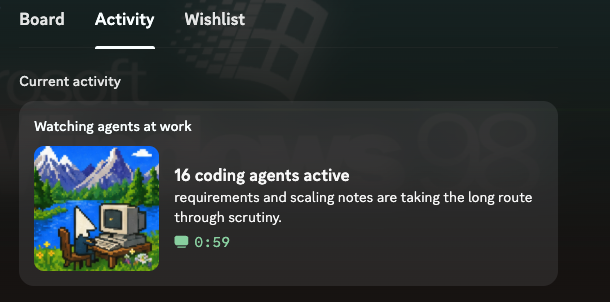

# Agent activity status

<p align="center">
  
</p>

Local-first AIM-style status updates for unattended Pi and Codex coding agents. Exact native lifecycle events determine presence; generated prose is advisory. Preview is the default and never contacts Discord.

## What it looks like



The count comes from exact native lifecycle events. The activity sentence is privacy-reduced advisory prose.

## Install from source

Prerequisites: Python 3.12+, [uv](https://docs.astral.sh/uv/), and Git. This project is installed from a checkout; it is not a PyPI release.

```bash
git clone https://github.com/safurrier/agent-away-message.git agent-away-message
cd agent-away-message
UV_TOOL_BIN_DIR="$PWD/.bin" uv tool install --from . agent-away-message
export PATH="$PWD/.bin:$PATH"
agent-away-message --help
```

The explicit tool-bin directory keeps the source install local to the checkout; exporting it lets `setup` embed the same executable path in native integrations.

First confirm the deterministic, privacy-safe fixture path (no model or Discord required):

```bash
agent-away-message --json fixture inspect tests/fixtures/dogfood-events.jsonl
# {"active_agents": 2, "records": 2, "valid": true}
```

`mise run dogfood` runs the same fixture check for contributors, but mise is not required for the source-install path above.

## Configure a model

By default, configuration is read from `agent-away-message/config.toml` under the platform user configuration directory: `~/.config/agent-away-message/config.toml` on Linux (or `$XDG_CONFIG_HOME`), `~/Library/Application Support/agent-away-message/config.toml` on macOS, and `%LOCALAPPDATA%\agent-away-message\config.toml` on Windows. Put a TOML file anywhere and select it explicitly with `--config`:

```bash
agent-away-message --config "$PWD/config.toml" --json doctor
```

A local OpenAI-compatible server is credential-free and must be loopback HTTP(S):

```toml
schema_version = 2
context_mode = "generic"
[stage_one]
backend = "local"
[stage_one.local]
url = "http://127.0.0.1:8012/v1"
model = "local-model"
[stage_two]
backend = "local"
[stage_two.local]
url = "http://127.0.0.1:8012/v1"
model = "local-model"
```

A trusted generic command adapter is also supported. Core executes the absolute executable directly (no shell), in a temporary directory, with an empty environment unless names are allowlisted. It sends one stdin JSON envelope and accepts one bounded UTF-8 stdout response:

```toml
[stage_two]
backend = "command"
[stage_two.command]
executable = "/absolute/path/to/completion-adapter"
args = []
timeout_seconds = 90
pass_environment = []
```

```json
{"schema_version":1,"prompt":"..."}
{"schema_version":1,"completion":"..."}
```

Core keeps prompts out of argv, its environment, persistent files, and diagnostics and discards child stderr. A trusted adapter can itself log or transmit stdin, so adapter behavior is outside that core guarantee. Command failure has no backend fallback; continuous publication may retain only recent validated public prose. Candid command stage one requires `privacy.allow_remote_context = true`; stage two receives only public aggregate/activity data.

Optional [tested local-model server guidance](docs/tutorials/local-qwen.md) is kept outside this model-agnostic quick start.

## Connect Pi or Codex

Install either integration independently. The executable must be on `PATH`; the source-install steps above export the checkout-local tool directory. `setup` is additive and preserves existing hook entries.

### Pi

```bash
agent-away-message setup \
  --pi-extension ~/.pi/agent/extensions/agent-away-message.ts
agent-away-message --json doctor \
  --pi-extension ~/.pi/agent/extensions/agent-away-message.ts
# includes "executable": true and "pi_extension": true
```

### Codex

```bash
agent-away-message setup --codex-config ~/.codex/hooks.json
agent-away-message --json doctor --codex-config ~/.codex/hooks.json
# includes "executable": true and "codex_hook": true
```

After a native lifecycle event, preview locally before enabling publication:

```bash
agent-away-message --config "$PWD/config.toml" preview
```

## Publish to Discord

1. Create a Discord application in the [Discord Developer Portal](https://discord.com/developers/applications).
2. Upload the retained [application icon](docs/assets/branding/discord-application-icon.png), then copy the application's **Application ID** as the client ID.
3. Install and run the Discord desktop client on the same machine; Discord IPC is local.
4. After confirming preview, start publication explicitly:

```bash
agent-away-message --config "$PWD/config.toml" \
  --publication-mode discord daemon --discord-client-id YOUR_APPLICATION_ID
```

Discord receives only validated status prose and exact count metadata.

## Limitations and troubleshooting

- A loopback connection failure means start or correct the local compatible server.
- `command response invalid` means the adapter did not return the exact JSON protocol; `command request failed` covers timeout, launch, and nonzero exit without exposing child output.
- `doctor` reports safe configuration/integration failures; rerun `setup` with the relevant Pi or Codex path.
- Discord failures usually mean the desktop client is not running, the client ID is wrong, or IPC is unavailable.
- No active lifecycle records means preview has nothing to publish.
- Status prose is advisory: only exact lifecycle records determine presence. The core's process and persistence controls do not constrain a trusted command adapter's own logging, files, or network behavior.

For the detailed contract see [SPEC.md](SPEC.md), [architecture](docs/explanation/architecture.md), and the [decision ledger](docs/explanation/decision-ledger.md).
